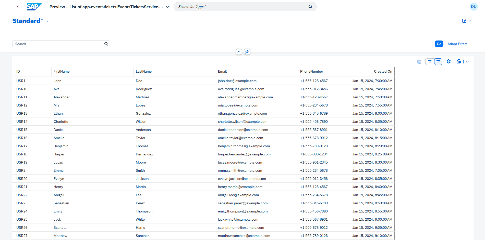

# Events Tickets SAP CAP API


Hay una [Versión en español](README_es.md) de este archivo.

This document provides an overview of the Events Tickets API, including instructions on how to use it, available routes, and details about its implementation. 

This exercise is part of the tasks for Week 2 of Globant's SAP CAP Bootcamp.

## Introduction

The Events Tickets API enables management of events, tickets, and users. It provides CRUD operations for each entity and includes a custom endpoint for purchasing tickets.

## Prerequisites

    Node.js (v14 or higher)
    npm (v6 or higher)
    CAP Framework
    HANA Database

## How to Run

Clone the repository:

```sh
git clone git clone https://github.com/migmm/events-manager.git
cd events-manager
```

Install dependencies:

```sh
npm install
```

Start the service:

```sh
cds watch --profile hybrid
```

    You need to have HANA activated to load and work with the dummy data tables.

## Functionality

This application retrieves a list of events and allows users to buy tickets, adding the ticket to the corresponding **Ticket** table.

By default, CAP exposes CRUD operations for the routes defined in the service. However, custom routes can be added for specific operations. A custom route has been included to “buy” a ticket.

Custom Route to Buy a Ticket

Request:

```sh
POST http://localhost:4004/odata/v4/events-tickets/BuyTicket
content-type: application/json

{
  "Event_ID": "EVT10",
  "User_ID": "USR26"
}
```

    Event_ID: ID of the event.
    User_ID: ID of the user.

## Entities

### Relationships Between Entities

The CDS model includes three main entities: Events, Tickets, and Users. Their relationships are defined as follows:

- Tickets to Events: The Tickets entity is associated with the Events entity via the Event_ID field, establishing a Many-to-One relationship (an event can have many tickets) explicitly defined in the Events entity with:

```javascript
    Tickets: Composition of many Tickets on Tickets.Event_ID = $self;
```

- Tickets to Users: The Tickets entity is associated with the Users entity via the User_ID field. The relation is one to one.


### Annotations

    cuid: Automatically generates a unique identifier for each record, ensuring uniqueness without manually specifying IDs.
    managed: Adds common fields managed by the system, such as createdAt, createdBy, modifiedAt, and modifiedBy. These fields are auto-populated when records are created or updated.

### Validations

Validation has been implemented using **@assert**.

FullStack Implementation

The project includes Fiori elements for front-end visualization. By default, it provides table views in HTML for the entities.

There are some screen captures that FIORI provides by default.

Events screen


Tickets screen


Users screen


## Dummy Data

Dummy data is included in the db/data directory to facilitate testing. This data can populate the database for API testing.
REST Client File

## REST Client File

A [HTTP request file](rest-client.http) to be used in [REST Client](https://marketplace.visualstudio.com/items?itemName=humao.rest-client) extension for VSCode. is included in the root directory. It contains pre-configured requests for all API endpoints.

## Source Information

- https://community.sap.com/t5/technology-blogs-by-sap/understanding-entity-relationships-in-cds/ba-p/13552921
- https://developers.sap.com/mission.hana-cloud-cap.html