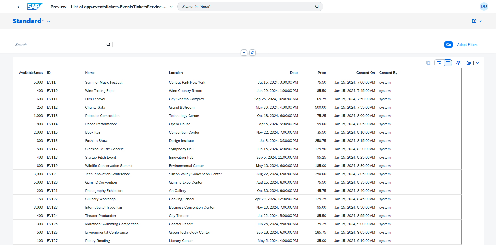
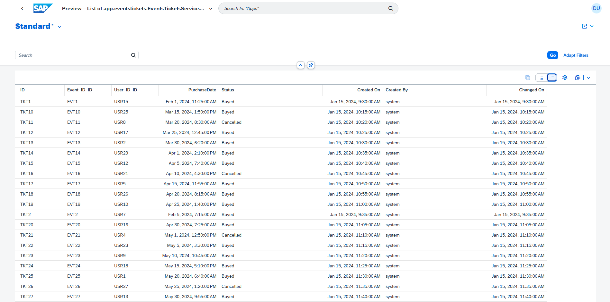
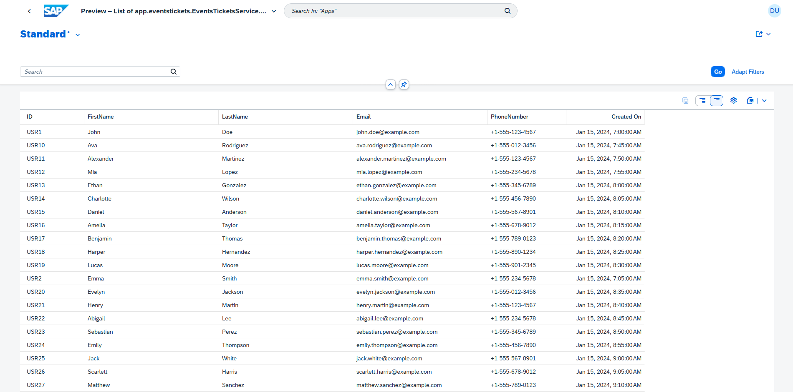

# API de Tickets de Eventos creada en SAP CAP


There is an [English version](README.md) of this file.

Este README proporciona una visión general de la API de Tickets de Eventos, incluyendo instrucciones sobre cómo usarla, rutas disponibles y detalles sobre su implementación.

Este ejercicio forma parte de las tareas de la Semana 2 del Bootcamp de SAP CAP de Globant.
Introducción

La API permite la gestión de eventos, tickets y usuarios. Proporciona operaciones CRUD para cada entidad e incluye un endpoint personalizado para la compra de tickets.

## Requisitos


    Node.js (v14 o superior)
    npm (v6 o superior)
    CAP Framework
    Base de Datos HANA

## Cómo Ejecutar la aplicación

Clonar el repositorio:

```sh
git clone https://github.com/migmm/events-manager.git
cd events-manager
```

Instalar las dependencias:

```sh
npm install
```

Iniciar el servicio:

```sh
cds watch --profile hybrid
```

Necesitás tener HANA activado para cargar y trabajar con las tablas de datos proporcionada.

## Funcionalidad

Esta aplicación funciona recuperando una lista de eventos y permite a los usuarios comprar tickets, añadiendo el ticket a la tabla correspondiente de Tickets.

Por defecto, CAP expone operaciones CRUD para las rutas definidas en el servicio. Sin embargo, se pueden agregar rutas personalizadas para operaciones específicas. Se ha incluido una ruta personalizada para "comprar" un ticket.

Ruta Personalizada para Comprar un Ticket

Solicitud

```sh
POST http://localhost:4004/odata/v4/events-tickets/BuyTicket
content-type: application/json

{
  "Event_ID": "EVT10",
  "User_ID": "USR26"
}

```
Copy

    Event_ID: ID del evento.
    User_ID: ID del usuario.

## Entidades

### Relaciones Entre Entidades

El modelo CDS incluye tres entidades principales: Events, Tickets, y Users. Sus relaciones se definen de la siguiente manera:

- Tickets a Events: La entidad Tickets está asociada con la entidad Events a través del campo Event_ID, estableciendo una relación Many-to-One (un evento puede tener muchos tickets) definida explícitamente en la entidad Events con:

```javascript
Tickets: Composition of many Tickets on Tickets.Event_ID = $self;
```
- Tickets a Users: La entidad Tickets está asociada con la entidad Users a través del campo User_ID. La relacion es uno a uno.

## Anotaciones en CDS

    cuid: Genera automáticamente un identificador único para cada registro, asegurando tener un ID sin necesidad de especificarlo manualmente.
    managed: Añade campos comunes gestionados por el sistema, como createdAt, createdBy, modifiedAt, y modifiedBy. Estos campos se rellenan automáticamente cuando se crean o actualizan registros.

## Validaciones

Se implementaron validaciones utilizando @assert.

## Implementación FullStack

El proyecto se inicializó como un proyecto FullStack, por lo tanto incluye elementos Fiori para la visualización en el front-end proporcionando por defecto vistas de tablas en HTML para las entidades.

Capturas de pantalla de la interface que proporciona FIORI.

Pantalla de Eventos


Pantalla de Tickets


Pantalla de Usuarios



## Registros para la base datos

Se incluyen datos dummy en la carpeta db/data para facilitar las pruebas. Estos datos pueden poblar la base de datos para pruebas de la API.

## Archivo de Cliente REST

Se incluye un archivo [HTTP request file](rest-client.http) en el directorio raíz para ser utilizado con la extensión de VSCode [REST Client](https://marketplace.visualstudio.com/items?itemName=humao.rest-client) . Contiene solicitudes preconfiguradas para todos los endpoints de la API.

## Fuentes

    https://community.sap.com/t5/technology-blogs-by-sap/understanding-entity-relationships-in-cds/ba-p/13552921

    https://developers.sap.com/mission.hana-cloud-cap.html